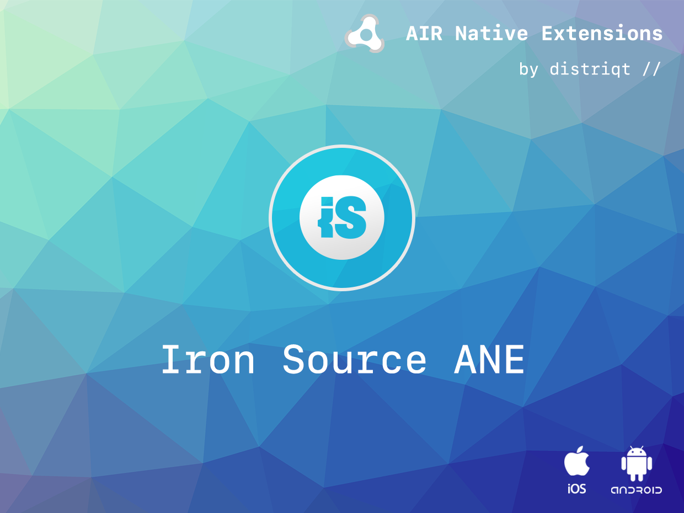

built by [distriqt //](https://airnativeextensions.com) 



# ISAllMediators

The [ISAllMediators](https://airnativeextensions.com/extension/com.distriqt.ISAllMediators) extension 
gives ... 


### Features:

- 
- Single API interface - your code works across supported platforms with no modifications
- Sample project code and ASDocs reference


As with all our extensions you get access to a year of support and updates as we are 
continually improving and updating the extensions for OS updates and feature requests.


## Documentation

The [Wiki](https://github.com/distriqt/ANE-ISAllMediators/wiki) forms the best source of detailed documentation for the extension along with 
the [asdocs](https://distriqt.github.io/ANE-ISAllMediators/asdocs). 

Quick Example: 

```actionscript
```

More information here: 

[com.distriqt.ISAllMediators](https://airnativeextensions.com/extension/com.distriqt.ISAllMediators)


## License

You can purchase a license for using this extension:

[airnativeextensions.com](https://airnativeextensions.com/)

distriqt retains all copyright.


