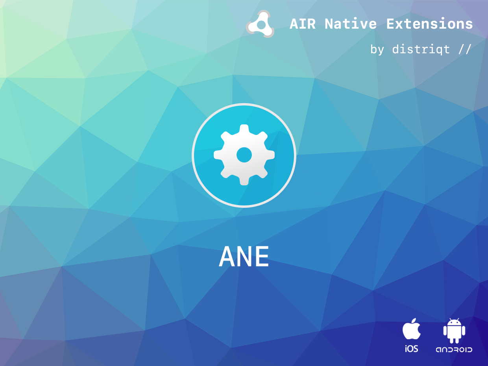

# IronSource

IronSource is an AIR Native Extension to access the [IronSource](https://www.ironsrc.com/) advertising SDK for in app monetisation.

>
> The biggest game developers in the industry trust ironSource with their app businesses because we provide everything they need in one powerful platform.
>


IronSource does provide an ANE independent of this ANE. We developed this ANE so we can update the ANE to match the latest native versions without waiting for updates from IronSource directly, which seem to lag behind the native SDKs.


#### Features

- Monetization - One of the industry’s largest in-app ad networks leveraging all available ad units to drive revenue and user engagement.
- Single API interface - your code works across supported platforms with no modifications
- Sample project code and ASDocs reference
- Mediation:
  - AdColony
  - AdMob
  - Amazon
  - AppLovin
  - Chartboost
  - Facebook Audience
  - Tapjoy
  - UnityAds


## Documentation

The [wiki](https://github.com/distriqt/ANE-IronSource/wiki) forms the best source of detailed documentation for the extension along with the [asdocs](https://distriqt.github.io/ANE-IronSource/asdocs). 

Quick Example: 

```actionscript
IronSource.instance.init( Config.IRONSRC_APP_KEY, [ IronSource.REWARDED_VIDEO ] );

if (IronSource.instance.isRewardedVideoAvailable())
{
    IronSource.instance.showRewardedVideo();
}
```

More information here: 

[com.distriqt.IronSource](https://airnativeextensions.com/extension/com.distriqt.IronSource)


## Native Extensions

The highest quality and widest range of Native Extensions for Adobe AIR

With many native extensions available, we are the largest provider of native extensions for AIR developers. 
Our mobile solutions allow developers to fast-forward development and focus on building great games and apps.

[https://airnativeextensions.com](https://airnativeextensions.com)


