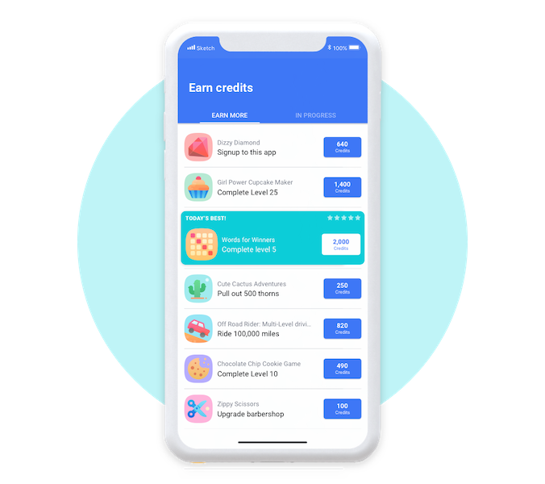

The offerwall is an in-app advertising unit that app developers use to monetize their apps. It acts like a mini-store in an app, listing multiple “offers” that users can complete in exchange for receiving an in-app reward. For example, users can receive extra in-app coins if they choose to register a username, get to level 25 on a game, make an in-app purchase, and more on the offerwall.



## Availability

You can check whether the offerwall is currently available at any time by checking the `isOfferwallAvailable()` method:

```as3
if (IronSource.instance.isOfferwallAvailable())
{
    // Offerwall is available
}
```

You can also listen for the `OfferwallEvent.AVAILABLE` to respond to changes in the availability of the offerwall.

```as3
IronSource.instance.addEventListener( OfferwallEvent.AVAILABLE, offerwallAvailabilityHandler );

function offerwallAvailabilityHandler( event:OfferwallEvent ):void 
{
    // Offerwall availability has changed

    if (IronSource.instance.isOfferwallAvailable())
    {
        // Offerwall is available
    }
}
```


## Present the Offerwall

Once the Offerwall is available you can call `showOfferwall()` to present the offerwall to your user (typically done after a user clicks on some in-app button).


```as3
IronSource.instance.showOfferwall();
```

You should always check if the offerwall is available before showing and react accordingly:

```as3
if (IronSource.instance.isOfferwallAvailable())
{
    IronSource.instance.showOfferwall();
}
else 
{
    // Inform user feature not available currently
}
```

There are several events associated with the display of the offerwall:

- `OfferwallEvent.OPENED`: Dispatched when the Offerwall is opened;
- `OfferwallEvent.CLOSED`: Dispatched when the Offerwall is closed;
- `OfferwallEvent.SHOW_FAILED`: Dispatched if the Offerwall failed to show;


```as3
IronSource.instance.addEventListener( OfferwallEvent.OPENED, openedHandler );
IronSource.instance.addEventListener( OfferwallEvent.CLOSED, closedHandler );
IronSource.instance.addEventListener( OfferwallEvent.SHOW_FAILED, errorHandler );

if (IronSource.instance.isOfferwallAvailable())
{
    IronSource.instance.showOfferwall();
}


function openedHandler( event:OfferwallEvent ):void 
{
    // Offerwall opened
}

function closedHandler( event:OfferwallEvent ):void 
{
    // Offerwall closed
}

function errorHandler( event:OfferwallEvent ):void 
{
    // Check event details for error information
}
```

## Reward the User

There are 2 methods of rewarding your user, using:

- Client side callbacks;
- Server side callbacks;


### Client side

#### Proactive polling 

You can poll at any time to retrieve the user's total credits and any new credits.

To do this call the `getOfferwallCredits()` function and await the following events:

- `OfferwallEvent.AD_CREDITED`: Dispatched when the call completes successfully, the event will contain the current user credits;
- `OfferwallEvent.GETOFFERWALLCREDITS_FAILED`: Dispatched if there was an error retrieving the user's credits;


```as3
IronSource.instance.addEventListener( OfferwallEvent.AD_CREDITED, adCreditedHandler );
IronSource.instance.addEventListener( OfferwallEvent.GETOFFERWALLCREDITS_FAILED, errorHandler );

IronSource.instance.getOfferwallCredits();


function adCreditedHandler( event:OfferwallEvent ):void
{
    trace( "  credits=" + event.credits );
    trace( "  totalCredits=" + event.totalCredits );
    trace( "  totalCreditsFlag=" + event.totalCreditsFlag );
}

function errorHandler( event:OfferwallEvent ):void
{
    // Check event details for error information
}
```

The details retrieved in the event are:

- `credits` : The number of credits the user has earned since the last `OfferwallEvent.AD_CREDITED` event. Note that the `credits` may represent multiple completions;
- `totalCredits` : The total number of credits ever earned by the user;
- `totalCreditsFlag` :  In some cases, we won’t be able to provide the exact amount of credits since the last event (specifically if the user clears the app’s data). In this case the `credits` will be equal to the `totalCredits`, and this flag will be `true`;


#### Automatic Events

You can also enable automatic client side events by calling `setIronSourceClientSideCallbacks( true )` before you initialise the IronSource SDK.

Setting automatic client-side callbacks will make sure that you’re notified about the user’s credit status at specific points in the Offerwall’s lifecycle.

```as3
IronSource.instance.setIronSourceClientSideCallbacks(true);

IronSource.instance.init( ... );
```

>
> **Important! This code MUST be implemented before calling the init.**
>

Using this method the `OfferwallEvent.AD_CREDITED` will be dispatched automatically as part of the offerwall lifecycle.


### Server side

See the ironSource documentation for details on server side callbacks and rewarding users.

If you turn on server-to-server callbacks in addition to the client-side callbacks, remember not to reward the user more than once for the same completion. ironSource will fire both the client-side callback and the server-to-server callback. You will get two notifications for each completion.


## Errors

See the complete description of the ironSource errors .
